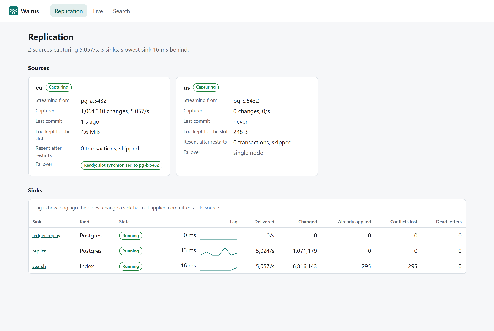

# Walrus

Change data capture from Postgres: every committed insert, update and delete, read from the write-ahead log in
commit order, landed in a durable outbox, and applied to other databases, a search index or a webhook, in order
for each row and exactly once in effect. Proven where it usually breaks: while the source's primary is being
killed.

Measured on one laptop (Intel Core Ultra 7 255H, Docker Desktop with 16 vCPUs), with every number reproducible
from `load/Walrus.Load`:

- **Fifty primary failovers under write load, nothing lost and nothing reordered.** 809,126 acknowledged writes,
  every one in the source and the sink afterwards, each row's changes applied in commit order, the two tables
  identical. Capture resumed on the promoted standby a median of 1.6 s after the kill.
- **Commit to sink p99 of 104 ms at 3,000 changes a second for ten minutes** (p50 13 ms), 1.8 million rows, and
  **p99 269 ms at 5,000 a second** (p50 30 ms), 3 million rows. None applied out of order; sink equal to the source.
- **Ten million changes replayed into a new sink in 268 s**, 37,000 a second, after capture took them at 69,000 a
  second.
- **A sink bootstrapped from a snapshot while writes are running** matches the source and a sink that received every
  change as a stream, row for row.

```bash
docker compose up -d --build --wait     # two regions, one of them a failover pair, a store, Walrus, the console
bash docker/demo.sh                     # a replica and a search index, and a few rows in both regions
docker compose exec store psql -U postgres -d sink -c "select * from profiles"
```

```text
 id | name  |   city   | plan
----+-------+----------+------
  7 | linus | Portland | team
```

One region moved the city and the other changed the plan, at the same time, and the replica kept both. The console
is at http://localhost:5191, and [`Walrus.http`](Walrus.http) walks through every endpoint.



## Why this exists

Keeping a second store in step with a database looks like a dual write: save the row, publish an event. The two
writes are not atomic, so a crash between them leaves the second store wrong forever, and concurrent transactions
publish in whatever order their threads finish. Polling an `updated_at` column misses deletes and reorders commits
inside the same millisecond.

The database already has the right answer: its write-ahead log, which records every committed change once, in commit
order, deletes included. Reading it is the easy part. The hard parts are what happens when the reader crashes between
storing a change and telling the database it can forget it, when the primary dies and a standby takes over with its
own copy of the log, and when two regions write the same row.

## What is worth looking at

| | |
|---|---|
| The two lines everything depends on: persist, then acknowledge | [`CaptureSession.cs`](src/Walrus.Application/Capture/CaptureSession.cs) |
| One writer per source: a lease to start, an epoch to finish | [`CaptureStore.cs`](src/Walrus.Infrastructure/Store/CaptureStore.cs) |
| A row's state as maximums, so order, repetition and grouping stop mattering | [`KeyState.cs`](src/Walrus.Domain/KeyState.cs), [`KeyStateProperties.cs`](tests/Walrus.UnitTests/KeyStateProperties.cs) |
| Per-row order across parallel lanes, and parking only the row that is refused | [`SinkDispatcher.cs`](src/Walrus.Application/Dispatch/SinkDispatcher.cs) |
| Decoding `pgoutput`, and refusing to resume when the outbox is ahead of the source | [`PgOutputLog.cs`](src/Walrus.Infrastructure/Source/PgOutputLog.cs) |
| The row and its state in one sink transaction | [`PostgresSinkWriter.cs`](src/Walrus.Infrastructure/Sinks/PostgresSinkWriter.cs) |
| A node that decides at every start whether to rewind and follow its peer | [`node-entrypoint.sh`](docker/source/node-entrypoint.sh) |
| Killing the primary under load and proving nothing was lost | [`Scenarios.cs`](load/Walrus.Load/Scenarios.cs) |

## How it works

```text
  eu primary ──┐ pgoutput, one slot per source,           ┌──▶ Postgres sink   row + its state, one transaction
  (standby     │ failover-synchronised to the standby      │
   holds a copy├──▶ capture ──▶ outbox ──▶ dispatch ──────┼──▶ index sink      in memory, rebuilt by replay
   of the slot)│    persist,     (store)    lanes by row,  │
  us primary ──┘    then ack                  retry, park  └──▶ webhook         signed, at least once
                                  │
                        console ◀─┴─ stats, live feed (SSE), dead letters, search
```

**Acknowledged only when durable** ([ADR 0001](docs/adr/0001-acknowledge-the-slot-only-after-the-outbox-commit.md)).
Capture writes whole source transactions to the outbox in group commits and only then tells the slot it may forget
them. A crash in between costs a resend, which is recognised by position and skipped. One session writes a source at
a time, held by an advisory-lock lease, and a session that lost its lease without noticing is refused by an epoch
([ADR 0002](docs/adr/0002-one-capture-session-per-source-lease-and-epoch.md)).

**Ordered by lane, idempotent by state** ([ADR 0003](docs/adr/0003-ordering-by-lane-idempotency-by-row-state.md)).
Every change to a row goes down one lane, and lanes run in parallel. Each sink keeps a state per row built entirely
from maximums over (clock, source, ordinal), so a change delivered twice, late, or grouped differently gives the same
row. The Postgres sink writes that state in the same transaction as the row, which is what makes a replay of the whole
outbox change nothing.

**Two regions, one answer** ([ADR 0004](docs/adr/0004-conflicts-resolve-by-hybrid-clock-or-merge-columns.md)).
Changes carry a hybrid logical clock, so every sink picks the same winner whatever order it heard them in. A table can
instead merge column by column, which is how the demo keeps both regions' edits.

**Failover without a gap** ([ADR 0005](docs/adr/0005-source-failover-through-slot-synchronisation.md)). The slot is
created with failover enabled and synchronised to the standby; `synchronized_standby_slots` keeps capture from seeing
anything the standby has not received; commits are synchronous. Capture finds whichever node is primary, and refuses
to resume if the outbox is ahead of it rather than skip what the new primary writes there.

**Snapshots with no seam** ([ADR 0006](docs/adr/0006-snapshot-seam-at-the-exported-consistent-point.md)), **a refused
row parks alone while a down sink is simply retried** ([ADR 0007](docs/adr/0007-park-the-refused-row-retry-the-sink-that-is-down.md)),
**the store is an EF Core context used directly** ([ADR 0008](docs/adr/0008-the-store-is-an-ef-core-context-used-directly.md)),
and **personal data is masked before it is stored, while the console holds no credential**
([ADR 0009](docs/adr/0009-mask-at-capture-and-hold-no-credential-in-the-console.md)).

## Layers

| Project | Holds | May reference |
|---|---|---|
| `Walrus.Domain` | change events, versions, the hybrid clock, row state and its convergence, table policies, masking, sink definitions | the base library only |
| `Walrus.Application` | the capture session, the stamper, dispatch and its watermark, the sink supervisor, the ports they need | Domain, logging abstractions |
| `Walrus.Infrastructure` | `pgoutput` capture, the EF Core store, the three sinks, snapshots, telemetry, hosting | Application |
| `Walrus.Api` | the HTTP surface and the host | Infrastructure |

`ArchitectureTests` checks this against what each compiled assembly actually references.

## The measurements

| | |
|---|---|
| Failover under write load | [`docs/benchmark-results/failover.md`](docs/benchmark-results/failover.md) |
| Commit-to-apply lag and throughput | [`docs/benchmark-results/lag-and-throughput.md`](docs/benchmark-results/lag-and-throughput.md) |
| Capture and replay of ten million changes | [`docs/benchmark-results/replay.md`](docs/benchmark-results/replay.md) |
| CPU cost of each step, without a database | [`docs/benchmark-results/pipeline.md`](docs/benchmark-results/pipeline.md) |

## Running it

| | |
|---|---|
| Everything | `docker compose up -d --build --wait` |
| Demo sinks and rows | `bash docker/demo.sh` |
| API | http://localhost:5190 (OpenAPI at `/openapi/v1.json`) |
| Console | http://localhost:5191 |
| Sources | eu primary and standby on 5433 and 5434, us on 5435, database `shop` |
| Store and sink | 5436, databases `walrus` and `sink` |
| Tokens and passwords | in [`compose.yaml`](compose.yaml); public, localhost only |

To reproduce the measurements against that stack:

```bash
dotnet run -c Release --project load/Walrus.Load -- soak --rate 3000 --seconds 600
dotnet run -c Release --project load/Walrus.Load -- failover --cycles 50 --rate 500
dotnet run -c Release --project load/Walrus.Load -- replay --changes 10000000
dotnet run -c Release --project load/Walrus.Load -- traffic    # a gentle stream for the console
```

## Tests

| Suite | What it covers |
|---|---|
| `tests/Walrus.UnitTests` (68) | convergence of row state as properties and against a reference, the clock, the watermark, stamping, masking, dispatch ordering and parking against in-memory ports, the capture session's persist-then-acknowledge order, the layering |
| `tests/Walrus.IntegrationTests` (13) | a real slot on Postgres 18: decoding every operation with before images and unchanged large values, a session that never acknowledges, a store that fails mid-stream, the lease and the epoch, masking; the running host: convergence and order, replay, the snapshot seam under load, two regions in conflict, merge tables, dead letters, the API's tokens and validation |
| `web` (10 Vitest, 4 Playwright) | response contracts, rates and lag, the live feed's parsing and cleanup, the journeys against the compose stack, axe on every screen |

CI runs all of it, plus licence audits for NuGet and npm, formatting, a benchmark smoke run, a check that the committed
OpenAPI document and the console's generated types match the server, and the compose stack: the quick start with
assertions, a minute of soak at 3,000 changes a second, and failovers under write load.

## What differs from the plan

The development plan this was built from made choices that were changed on purpose: .NET 10 rather than 9; Vue rather
than React, to match the rest of this portfolio; an EF Core context rather than Dapper for the store, which is the house
rule, with a binary COPY on the hot path; a small in-memory index rather than Lucene.NET, since the sink exists to show
an apply model, not search quality; the harness in .NET rather than k6; and a sink that is down is retried rather than
dead-lettered ([ADR 0007](docs/adr/0007-park-the-refused-row-retry-the-sink-that-is-down.md)).

## Stack

.NET 10 and C# 14, ASP.NET Core minimal APIs with source-generated JSON, Npgsql's logical replication client,
EF Core 10 on Postgres 18, OpenTelemetry. Vue 3, TanStack Query and Zod for the console. xUnit v3, FsCheck,
Testcontainers, Playwright and BenchmarkDotNet for the proofs. Every dependency is permissively licensed, checked on
every build.

## Limitations

The honest list is in [`docs/operations.md`](docs/operations.md#known-limitations). The ones to know first: Postgres
is the only source; truncates and schema changes are not captured; conflicts between regions follow their clocks; and
the console is a read-only view meant to sit behind your own authentication.

## Licence

MIT.
